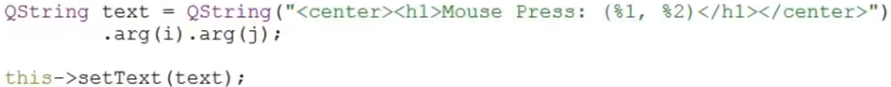
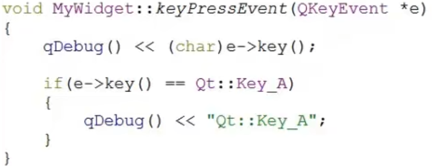

# 黑马程序员Qt

## P1、为什么学QT

~~~~
1）从嵌入式过来，不用新学习 java 等新的上位机语言。
2）锻炼编程能力（既要考虑图形界面，又要考虑后台程序）
3）为了更好的使用C++

如何学习Qt？  需要学会Qt的帮助文档。调用Qt封装好的API。
~~~~

## P2、课程安排

~~~
~~~

## P3、QT介绍

~~~
Qt 是一个跨平台的C++ 图形用户界面应用程序框架。C++面向对象编程。
讲解了QT的发展史等
~~~

## P4、QT应用程序框架

~~~c
1- 创建部分
注意:qt的项目路径中不允许有中文

1）新建项目->widget
2）选择保存路径

三种基类：
	QMainWindow：PC的窗口
	QWidget：所有图形库的基类
	QDialog：对话框
	
2- 程序中的框架介绍
	1）QApplication 应用程序类（有且只有一个应用程序类对象）
	2）Qt头文件没有.h
	3）头文件 和 类名一样
	4）头文件类中的 Q_OBJECT 是使用信号和槽的时候需要
    
    
3- 主框架介绍
    
int main(int argc, char *argv[])
{
	//有且只有一个应用程序类的对象
	QApplication a(argc,argv);

	//MyWidget继承与QWidget，QWidget是一个窗口基类
	//所以MyWidget也是窗口类
	//w就是一个窗口
	MyWidget w;
	
	//窗口创建默认是隐藏，需要人为显示
	w.show();
	
	//让程序一直执行，等待用户操作
	//等待事件的发生
	return a.exec();
}
~~~

## P5、项目文件

~~~c
1）项目文件中的注释 需要用 # 

2）将 光标放到 QWidget 的地方，按下F1，可以直接跳到帮助文档中，可以只知道使用这个控件需要包含什么头文件 以及 需要在 pro 文件中添加哪个模块。（因为包含的头文件会在模块中寻找）

~~~

## P6、第一个QT项目

~~~c
//从0开始写代码（实际使用会有框架的，这个只是为了锻炼）
1）创建新项目 -> 其他项目 -> 空项目
2）根据上面的框架，以及创建一个QWidget 并显示，不显示的话不会出现。
~~~

## P7、指定父对象

~~~
1）如果不指定父对象，对象和对象（窗口和窗口）没有关系，相互独立。a指定b为它的父对象，a放在b的后面。
指定父对象两种方式：
	1- setParent();
	2- 通过构造函数传参

注意：如果不设置父对象的话，创建几个对象就会出现几个窗口
~~~

## P8、标准信号和槽

~~~c
不使用空项目，使用 Application 项目

1）创建一个对象后，先执行自己的构造函数。 需要添加的控件在自定义类中的构造函数中创建。

2）QPushButton 的使用
	QPushButton b1;
	QPushButton *b2;

	b1.setParent(this);
	b1.setText("close");
	b1.move(100,100);

	b2 = new QPushButton(this);
	b2->setText("abc");
	
	//信号发出者；处理的信号；信号接收者；槽函数
	connect(&b1, &QPushButton::pressed, this, &MainWidget::close);
~~~

## P9、自定义槽函数

~~~
1）自定义槽，普通函数的用法
	1- Qt5：任意的成员函数，普通全局函数，静态函数
	2- 槽函数需要和信号一致（参数，返回值）
	3- 由于信号都是没有返回值，所以，槽函数一定没有返回值。

2）可用于类比
	信号（当成短信）
	槽函数：接收短信的手机
	
	一个短信可以同时发送给多个手机。

~~~

## P10、两个独立的窗口

~~~c
1）创建一个子窗口类，被包含在父窗口中。在父类中定义一个变量，但在创建的时候不指定父对象，这样就可以同时产生父窗口和子窗口。
    
2）添加信号，进行窗口的切换
~~~

## P11、自定义信号

~~~c
延续上面，使用自定义信号进行窗口的切换

1）信号必须用 signals 关键字来声明
    1- 信号没有返回值，但可以有参数 
    2- 信号就是函数的声明，只需声明，无需定义 
    3- 使用：emit mySignal(); 
    
    如果是子窗口的操作，可以只发送信号，不执行操作，操作留给父窗口来解决。（类似于操作让上司做决定，因为子窗口可能“权限不够”）
    
~~~

## P12、复习

~~~
1）如果是时使用别人的代码，需要将 .user 文件删除，在项目中重新选定构建目录。不然会构建失败啦

2）QWidget 是所有UI窗口的基类；QDialog 是对话框，不能放大或缩小。
~~~

## P13、带参数的信号

~~~
1）打印窗口： 头文件为 QDubug，但是实际使用时确实qDebug() << ;

2）如果使用的信号，函数重载了，可以时使用函数指针的方式进行区分，但要注意需要加上作用域。（如下）
	//或者使用QT4的信号连接，可以自定义选择有参函数和无参函数。不用的原因：
	1）宏替换容易出错，不会检查语法错误
	2）槽必须加上 slots 关键字，不然识别不出来。（QT5是个函数就可以当槽）
~~~

~~~c
3）如果要输出中文，需要将输出变量转换成 char* 格式的
	eg： str.toUtf8().data(); 
	//str.toUtf8() --> 字节数组QByteArray
	//......data() --> QByteArray --> char* 
~~~

## P14、Lambda表达式和再说信号的功能

~~~c
1）lambda表达式，匿名函数对象
	C++增加的新特性，项目文件： CONFIG += C++11
	Qt配合信号一起使用，非常方便。
    
    eg：connect(&btn, &QPushButton::released, 
              
               {
                   qDebug() << "11111111" ;
               }
              );

2）Lambda 表达式语法
    [] ：中就是将需要传进来的变量写入。
    
    // [] 中的内容解释
    = ：表示把外部所有局部变量、类中所有成员以值传递进来。（拷贝过程，慢但安全。）
    	如果需要修改里面的值，可以使用 mutable 关键字。
    this：类中所有成员以值传递方式传入
    & ：把外部所有局部变量，引用符号。
    
3）信号属于谁的，就是谁来发出的信号。
~~~

## P15、坐标系统

~~~
1）QWidget 是所有的基类，所以找不到信号、槽等都可以使用这个来查找。

2）坐标相对
	1- 父窗口 坐标系统是相对于屏幕的。x：往右递增；y：往下递增。
	2- 子窗口，坐标系统相对于父窗口。原点：相对于窗口空白区域左上角。x：往右递增；y：往下递增。
~~~

## P16、内存回收机制

~~~
1）new 是动态申请内存创建的。释放的话会在QT的内存树中进行自动释放。（而使用 静态定义变量，比如：QPushButton b1。就不在内存树中，释放的时候就需要手动释放，就会很容易出现问题，所以一般都是使用动态内存申请的方式进行。）

2）自动释放条件
	1- 指定父对象
	2- 直接或间接继承于QObject
	子对象如果是动态分配空间的new，不需要手动释放delete，系统会自动释放。

不懂的地方？？？？
	以参数列表的方式给构造函数传参。（C++的东西，不是很懂）

~~~

## P17、菜单栏 工具栏

~~~
1）PC端比较多的就是 QMainWindow 
	1- addDockWidget() 就是 添加一个浮动栏。
	
	
2）菜单栏 【QMenuBar、QMenu、QAction】
	1- 菜单栏：QMenuBar （自带菜单栏，QMenuBar *mBar = menuBar(); ）
	2- 菜单：QMenu 
	3- 菜单项：QAction 
	4- 添加分割线（在菜单那一项中添加）
		PFile->addSeparator(); //添加分割线
~~~

~~~c
3）工具栏【QToolBar】
	QToolBar *toolBar = addToolBar(toolBar);
	
	//工具栏添加快捷键(也可以添加按键)
	toolBar->addAction(pNew);
	
	QPushButton *b = new QPushButton(this);
	b-setText("^_^");
	//添加进工具栏
    toolBar->addWidget(b); 

~~~

## P18、核心控件和浮动窗口

~~~c
===> 继上内容
4）状态栏 【QStatusBar】
    //获取状态栏
    QStatusBar *statusBar = statusBar();
	//状态栏可以从右添加，也可以从左添加
~~~

~~~c
5）核心控件【QTextEdit、QDockWidget】
	将函数的参数填满，就可以使用 F1 进行跳转了。
	//按下面的图片进行操作。
~~~

## P19、模态和非模态对话框

~~~
1）模态对话框
	对话框出现后，不能操作后面的界面
~~~

~~~
2）非模态对话框
	对话框出现后，可以操作后面的界面
~~~

## P20、标准对话框和文件对话框

~~~
1）标准对话框【QMessageBox】
	QMessageBox::about(thiss,"about","关于Qt");
~~~

~~~
2）问题对话框
	QMessageBox::question(this,"question","Are you ok?",QMessageBox::Ok | QMessageBox::Cancel);
~~~

~~~c
3）文件对话框【QFileDialog】
//父对象、标题、打开的默认目录、可选择的文件类型
QFileDialog::getOpenFileName(this,"open","../","souce(*.cpp *.h);;Text(*.txt);;all(*.*)");
~~~

## BP1、复习上述

~~~
~~~

## BP2、设计器的使用

~~~c
1）修改按键的名称，以及按键中的字符。//也可以使用代码进行操作
2）链接按键操作 以及 信号和槽。

~~~

## BP3、常见控件01

~~~c
1）Layout：布局类
2）Spacers：弹簧类
3）Buttons：按钮类【常用】
4）Item Views（Model-Based）：类似于网格形式
5）Item Widgets（Item-Based）：类似于竖着的列表
6）Containers：容器类
7）Input Widgets：输入控件【常用】
8）Display Widgets：显示控件【常用】

//-----------------------------------------------
	1- 在UI界面中使用信号和槽，直接添加。并做简单的切换应用。

    2- Frame 和 Widget 的区别就是前者有边框，后者无边框。
    
    3- 设置边框距离，以像素点为单位
	    lineEdit->setTextMargins(15,0,0,0); 
	4- 设置内容显示方式
        lineEdit->setEchoMode(QLineEdit::Password);

	5- 设置成输入有提示的方式【如下图】【QCompleter、QStringList】
        QCompleter（字符比较器） / QStringList（字符串列表）
~~~

## BP4、常见控件02

~~~c
1）输入控件
	1- Combo Box
	2- Font Combo Box 
	3- Line Edit //行编辑，只能一行
	4- Text Edit //文本编辑区，可以图片和网页内容
	5- Plain Text Edit //只能显示文字
	6- Spin Box //微调整形数据
	7- Double Spin Box //浮点微调数据
	8- Time Edit //时间编辑
	9- Date Edit //日期编辑
	10- Date/Time Edit //时间、日期一起编辑
	11- Dial //旋钮调整
	12-  //滚动条
	13-  //滑块
	14- Key Sequence Edit //设定快捷方式
	
	
2）显示控件
	1- Label //可以显示文字，也可以显示图片、GIF动画、网址
		//普通放置文字
    	label->setText("^_^"); 
		
		//设置图片
		label->setPixmap(QPixmap("://image/L.png"));
		label->setScaledContents(true);//自动缩放内容

		//创建动画【Qmovie】
		QMovie *myMovie = new QMoive("://image/m.gif");
		label->setMovie(myMovie);
		myMovie->start();
		label->setScaledContents(true);//自动缩放内容

		//设置html
		label->setText("<h1><a href=\"https://www.baidu.com\">百度一下</a></h1>"); //按照网页的格式进行写入
		label->setOpenExternalLinks(true); //设置以链接形式打开
		
	2- Text Browser  //文本浏览器

 	3- 数码管
        
	4- 进度条
        
	5- 分割线
~~~

## BP5、布局

~~~
1）如果不布局的话，就不会随着窗口的大小而变化。（一般使用UI，所见即所得。）
2） ui中直接点击中间的部分就可以设置整体的布局。

3）布局分为三种：
	1- 水平布局
	2- 垂直布局
	3- 网格布局
	
	一般会用到水平和垂直两种弹簧
	
4）弹簧可以设置固定的长度，设置SizeType 为 fixed 即可。
~~~

## BP6、自定义控件

~~~
1）自己做一个小控件，直接在ui界面中提升为即可。（全局包含）
~~~

## BP7、Qt样式表

~~~
1）和 thml 中 CSS 很类似。但是很多，直接使用样式表进行设置会方便很多。

2）样式表设置：可在ui中直接设置，也可在代码中设置

3）方箱模型中都是有四个同心相似的矩形组成，具体如下（如下图）
~~~

~~~c
4）当指定一个 “边框图片” 的时候，可以分割四条分割线，还能设置延展或者填充的方式。
	QPushButton{
		border-width: 4px;
		border-image: url(btn.png) 4 4 4 4 stretch stretch;
	}
	
按键的状态列表
~~~

~~~c
5）定义子部件的样式
~~~

## BP8、事件01

~~~c
1）Qt中所有的事件类都继承于QEvent。在事件对象创建完毕后，Qt将这个小事件对象传递给QObject的event()函数。evevt()函数并不直接处理事件，而是按照事件对象的类型分派给特定的事件处理函数。
    
2）事件处理函数 都在 QWidget中定义的，且都是虚函数，也是保护的函数。使用事件的时候需要自己重写这个函数。
~~~

## BP9、事件02

~~~c
1）重写的事件基函数不能使用 F1 跳转，因为其都在 Widget 里面。
2）Qt中的QString 输出使用情况
~~~

~~~c
3）其中可以用 html 格式进行调整
~~~

~~~c
4）设置默认追踪鼠标，则程序已启动就会进入鼠标事件
    this->setMouseTracking(true);
~~~

## BP10、事件03

~~~c
5）上面是鼠标按下、移动事件
6）下面学习设置键盘按下事件
~~~

~~~c
7）定时器事件
    1- 如果定时器以每秒的时间开启了，则每秒都会进入一次 timerEvent(QTimerEvent *ev) 函数
    
    2- 启动函数 startTimer() 是以 ms 为单位的。返回值是 定时器的ID号，所以可以根据定时器的ID号进行区分。
~~~

## BP11、事件的接收和忽略

~~~c
1）使用按键，重写按键的按下事件。 08：20
    重写事件在connect信号在此之后，如果在事件函数中已经处理了信号，则不会执行到后续的connect中的部分。
~~~

~~~c
2）通过调用父类的同名函数，我们可以把Qt的事件传递看成链状：如果子类没有处理这个事件，就会继续向其父类传递。Qt的事件有两个函数：
    accept(): 如果调用了这个函数，这个事件就不会被继续传播给父组件
    ignore(): 如果调用了这个函数，Qt则会从父组件中寻找后续接收者
    
    【事件处理】：类似于链式传递，如果前面的处理了后面的就自动忽略了；没人处理就会一直往后传递（传给的是父窗口，而不是父类（基类））。
    
3）一般应用场景如下：
~~~

## BP12、event()函数

~~~c
1）event()函数 主要是用来消息分发的。主要流程如下：
~~~

~~~c
2）如果传入的事件已被识别并且处理，则需要返回 true ，否则返回 false 。
    true ：Qt会认为这个事件已经处理完毕，不会再将这个事件发送给其它对象，而是会继续处理事件对列中的下一事件。
    
3）在 event() 函数中，调用事件对象的 accept() 和 ignore() 函数是没有作用的，不会影响到事件的传播。 
    
4）修改自己需要的事件，但也不影响其它的事件。
~~~

~~~c
5）所有的事件级管理，都可以在 QEvent() 中进行处理。单个的事件处理都是在 QEvent() 的下一层级，而在 QEvent() 中处理后，后续就不用管了，也不用写那么多的事件函数。
    类型处理：static_cast <QKeyEvent *> (e);
~~~

## BP13、事件过滤器_事件总结

~~~c
【注意】 事件过滤器 和 被安装过的组件必须在同一线程，否则，过滤器将不起作用。如果安装过滤器后，这两个组件到了不同的线程，那么只有等到二者重新回到同一线程的时候过滤器才会有效。

1）因为使用事件过滤器这种方式比较复杂(单一来看不复杂，但是需要修改的东西多了就复杂了。) 所以事件过滤器 就 应声而来。如图所示：
~~~

~~~c
2）事件过滤器：virtual bool QObject::eventFilter(QObject *watched, QEvent *event);

	步骤：
        1- 类中申明
        2- 函数实现
        3- 构造函数中安装 事件过滤器函数 ：
        	label->installEventFilter(this);

	如果需要使用其它的控件进行处理，安装对应的事件过滤器，即可在eventFilter中进行调用。
~~~

~~~c
/************************** 总 结 *************************/
按从小到大事件处理分为如下五个层次：
	1- 事件处理函数（eg：paintEvent()、mousePressEvent() 等）
	2- event()函数。作用是将事件传递给特定的事件处理函数
	3- 在特定对象上安装事件过滤器。仅过滤对象接收到的事件。【用这个就行了】
	4- 过滤所有对象的所有事件。 QCoreApplication::instance() 上安装事件过滤器，是全局过滤器（但只能用在主线程中）
	5- 不受线程的全局过滤器函数。重写QCoreApplication::notify()函数。
~~~

## CP1、复习上述

~~~
~~~

##CP2、猜数字答案

~~~
讲代码不带着做
~~~

##CP3、画背景图

~~~c
//需要包含头文件（QPainter、QPen、QBrush）

1）void PaintEvent(QPaintEvent *);
//窗口需要重绘的时候，绘图事件内部自动调用

QPainter ：画家
QPaintEngine ：
QPaintDevice ：

    //将长宽设置成窗口的大小就可以将图片设置成背景图了。
~~~

##CP4、简单绘图

~~~c
//需要包含头文件（QPainter、QPen、QBrush）
以下都在 paintEvent(QPaintEvent*) 中实现
~~~

## CP5、手动更新窗口

~~~
1）手动刷新
	1- 修改位置后调用 update() 函数进行重绘

2）先画背景在画线
	【注意】不要在 paintEvent中调用 update() 函数，不然会卡死

~~~

## CP6、QBitmap 和 QPixmap 的区别

~~~
1）如果给窗口绘图，一定要在 paintEvent(QPaintEvent*) 函数 中进行

2）QBitmap 和 QPixmap 
	1- QBitmap：用的多
	2- QPixmap：用的少（只有两个颜色）
~~~

