# STM32_FreeRTOS学习记录

## P1、搭建第一个freeRTOS工程

~~~
1）浅谈了下 Linux 内核和 FreeRTOS 内核的区别。
~~~

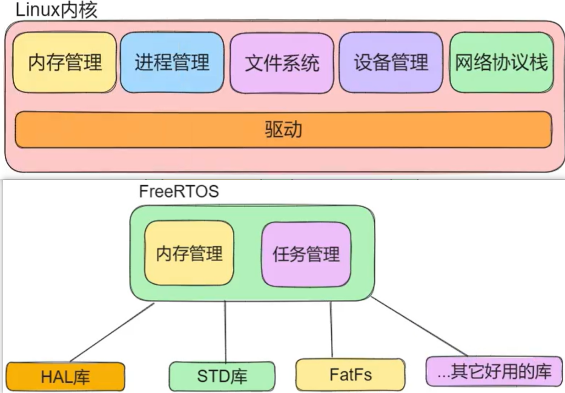

~~~c
2）使用软件进行快速配置。步骤如下：
	1- 输入芯片型号，进行搜索。点击后，选择 “start project” 即可。
	2- 打开后看到的芯片，以及引脚。小圆点位置逆时针旋转为 pin 1 ~ pin ? 。
	3- “Project Manager” 设置工程
		“Project”：设置名字以及项目路径、工具链选择“MDK-ARM”。
		“Code Generator”：拷贝所有库到文件中；将.c和.h分开即可。
	4- “Pinout & Configuration”
		"RCC": HSE 选择 外部晶振（Crystal/..）
		(如果不配置RCC的话会默认为systik，旁路时钟源需要外部提供时钟。)
		“SYS”：Debug 选择 serial Wire

	5- “Clock Configuration” 配置外部时钟源的时钟。随后即可右上角 “GENERATE CODE” 生成代码。 
	
	//但因为需要添加FreeRTOS，还需要如下步骤：
	
    6- 点击“Middleware”，配置interface为CMSIS_V2（最新的FreeRTOS版本）。其它配置，默认即可。生成代码即可
~~~

## P2、GPIO操作_HAL库

~~~c
1）GPIO输入的四种模式
	1- 上拉：无输入高电平
	2- 下拉：无输入低电平
	3- 浮空：适用于外部电平决定输入场景，或自带上下拉电阻的情况。
	4- 模拟输入：适用于读取外部模拟信号的情况
	
2）输出的四种模式：
	1- 推挽输出：适用于需要高电流驱动和快速切换的场景。（此时施密特触发器是打开的，即输入可用）
	2- 开漏输出：使用多个设备需要共享信号线，接口电平转换和高压负载等场景。pmos不适用，0：低电平；1：浮空电平（此时施密特触发器是打开的，即输入可用）
	3- 开漏复用输出：将引脚配置成多种用途，如硬件I2C。（此时施密特触发器是打开的，即输入可用）
	4- 推挽复用输出：使用于需要高电流驱动，快速切换和多功能复用的场景，可以加强驱动能力。
	
3）实际应用：将对应的LED灯点亮，根据原理图可知，低电平LED亮，高电平LED灭。故只能配置该引脚为推挽输出，因为开漏输出输出不了高电平。
	在帮助文档中查找对应的应用函数。
~~~

## P3、应用于驱动分离的工程结构

~~~c
1）简单实现点灯操作
for(;;)
{
    HAL_GPIO_WritePin(GPIOC,GPIO_PIN_13,GPIO_PIN_RESET);
    HAL_Delay(1000);
    HAL_GPIO_WritePin(GPIOC,GPIO_PIN_13,GPIO_PIN_SET);
    HAL_Delay(1000);
}

2）实际应用的时候，驱动和应用分离
    将驱动单独写一个文件，然后在应用中直接调用即可。
    1- 在自己写的驱动文件中直接包含 main.h 即可。
    2- 编写对应的驱动代码，比如 led_on(); led_off(); 控制LED灯的亮灭即可。
    3- 在freertos.c中调用对应的亮灭函数即可。
~~~

## P4、全彩LED灯模块的驱动实验

~~~c
1）创建第一个多任务程序，点亮彩色RGB灯。【实现驱动并验证】
	彩灯思路：
	1- 要么使用PWM波进行
	2- 要么使用定时器进行三种灯的精确控制
	3- 以上两种控制都需要学习其它知识才能使用，所以这里仅仅使用简单的高低电平控制即可。✅

2）编写驱动
	驱动向下调用寄存器，向上提供统一接口（HAL库）。
eg：
void color_led_set(u8 red,u8 green,u8 blue)
{
	//红
	HAL_GPIO_WritePin(GPIOA,GPIO_PIN_2,!red);
	//绿
	HAL_GPIO_WritePin(GPIOA,GPIO_PIN_15,!green);
	//蓝
	HAL_GPIO_WritePin(GPIOB,GPIO_PIN_3,!blue);
}

2）后续使用多任务就不用HAL中封装的os操作函数，直接使用freeRTOS提供的静态创建和动态创建任务的函数。（下节课讲）
    
~~~

## P5、第一个多任务并发执行的FreeRTOS工程

~~~
1）如何在freeRTOS中添加一个新的任务？
	xTaskCreate(...): 动态创建一个任务，创建成功返回0，创建失败返回错误码。
	1- 栈深度怎么看？
	2- 优先级大小：freeRTOS中数值越大，优先级越高。
	
	步骤：
	步骤一：定义一个任务函数（也算是回调任务）
	步骤二：使用xTaskCreate()创建一个任务
~~~

## P6、光敏模块和蜂鸣器模块驱动实验

~~~
1）【FreeRTOS】：通常任务是以无限循环的形式实现，任务函数不能是退返回或退出。但是，任务可以自我删除。
	1- 任务创建完成后就处于准备运行的任务列表中。
	2- 静态创建任务是需要自己定义 栈空间 的。
	
2）写驱动（蜂鸣器和光敏）
	1- 蜂鸣器：普通IO口 PA8
	2- 光敏模块：DO PB11、AO PA（DO端口设置为浮空输入）
		这个光敏电阻就是，光线强，电阻小，DO输出低电平，然后LED灯亮；光线弱LED灯就灭了。
~~~

## P7、应用程序分离与静态创建任务【^_^】

~~~

~~~

## P8、任务控制之两个阻塞演示函数

~~~c
1）任务的状态转换图（如下图所示）
~~~

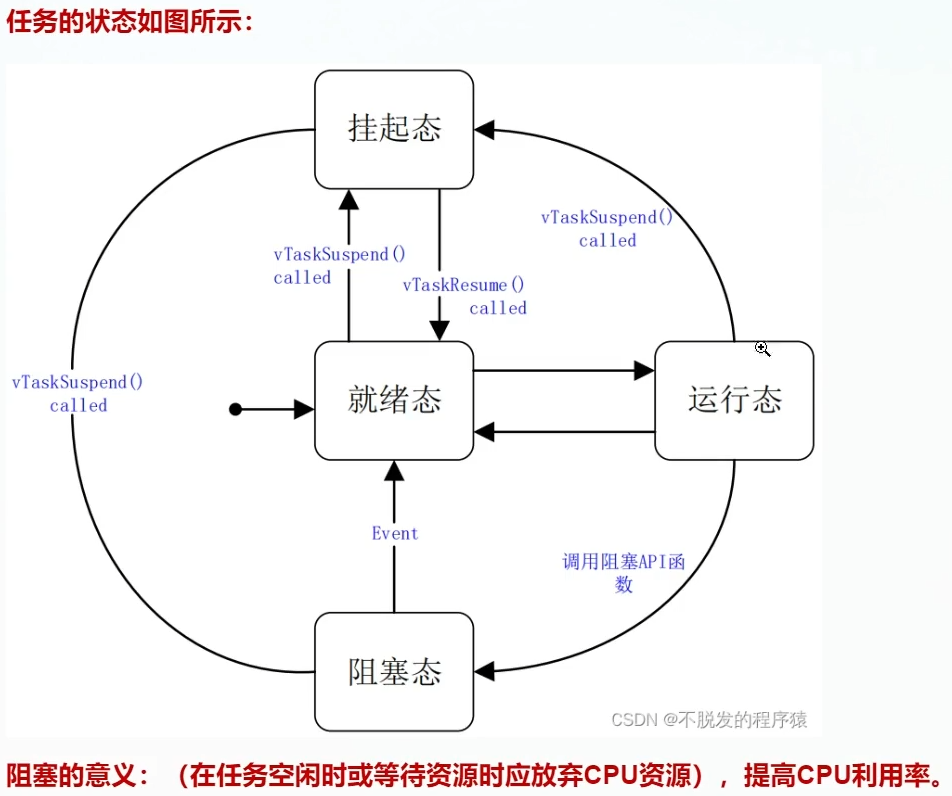

~~~c
2）任务在空闲时就需要调用 进入阻塞的函数进入阻塞状态。调用的函数如下：
    //延时时间固定为多少个Tick 【延时时间固定】
	1- void vTaskDelay(const TickType_t xTicksToDelay);
	//第一次使用需用当前时间初始化 【任务 加 延时的总时间固定】
	2- void vTaskDelayUntil(TickType_t *pxPreviousWakeTime,const TickType_t xTimeIncrement); 
	
	两个函数的区别见下图：
~~~

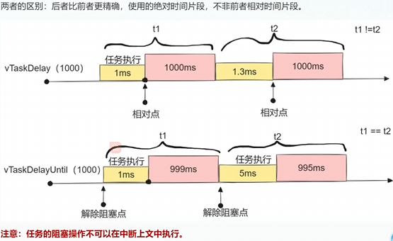

### 8.1 两种阻塞函数的使用方法

~~~c
3）两种阻塞函数的使用方法
    如延时1000ms：
    Hal_Delay(1000); //1 tick 是 1 ms
    【注意】:Hal_Delay()是盲等，不会放弃CPU资源，需要使用vTaskDelay()/vTaskDelayUntil()才有效果。
        
    1- 使用 vTaskDelay()：  
        vTaskDelay(1000);  //freeRTOS的时钟周期为1000HZ，每次也是1ms
	2- 使用 vTaskDelayUntil(初始时间,周期);
		A. TickType_t xLastWakeTime;
		B. const TickType_t xFrequency = 1000;
		C. xLastWakeTime = xTaskGetTickCount();
		D. vTaskDelayUntil(&xLastWakeTime, xFrequency);
~~~

##  P9、任务控制之挂起与唤醒

~~~c
1）任务暂停，并进入阻塞状态：vTaskSuspend(TaskHandle_t xTaskToSuspend)
	功能：暂停任意任务。无论任务优先级如何，任务被暂停后永远无法获取任何为控制器处理时间
	参数：被挂起的任务的句柄。传递空句柄将导致调用任务被暂停
    
2）任务被动唤醒：（被其它任务唤醒）vTaskResume(TaskHandle xTaskToResume)
	功能：恢复已挂起的任务
	参数：xTaskToResume 要恢复任务的句柄

3）挂起和唤醒的应用：
    比如说使用光敏传感器 的感知情况 去控制彩灯的闪烁与否。
    vTaskSuspend(TaskHandle_t xTaskToSuspend)函数 多次连续调用只会出现一次的现象。 
    vTaskResume(TaskHandle xTaskToResume)函数，调用一次就会使被挂起的任务唤醒。（唤醒是否会跳过当前的阻塞时长？不确定）
    
    【注意】中断中不能调用跟阻塞相关的函数，要保证中断中的快进快出。
~~~

## P10、任务控制之结束任务的方式

~~~c
1）void vTaskDelete(TaskHandle_t xTask);
	功能：此函数的作用为从RTOS内核管理中移除任务。被删除的任务将从所有的就绪、阻塞、挂起和事件的列表中移除。
	参数：待删除的任务句柄
	
	【注意】：
	1- 空闲任务负责 删除任务 ，所以在删除任务时需要保证空闲任务不会失去微控制器处理的时间；
	2- 任务删除了就是没了，如果还想使用就得重新创建；
	3- 任务删除时，动态申请的任务内存空间不会自动释放，应该在删除任务之前手动释放。如果是RTOS内核分配的内存，则由空闲任务释放。
	
2）任务结束千万不要使用 return; 不然的话会使任务进入错误处理的死循环中。
	任务自己删除自己：  vTaskDelete(NULL);
	任务删除其它任务：  vTaskDelete(任务句柄);
	
	//如果任务句柄不为空。则删除任务，删除之后，任务句柄置为NULL。然后空闲任务会自己释放掉内存。（延时是为了尽可能保证空闲任务能够接手释放内存，不加其实也没问题）
	if(defaultTaskHandle != NULL)
	{
		vTaskDelete(defaultTaskHandle);
		//vTaskDelay(100);
		defaultTaskHandle = NULL;
	}
	
3）所有任务在等待时都应主动释放CPU资源进入阻塞状态，以保证空闲任务的运行。
~~~

## P11、理解FreeRTOS的任务调度机制【^_^】

~~~
~~~

## P12、任务间同步通信方式之队列简述

### P12.1 队列概念

~~~
1）原本的情况：两个任务通信，使用一个全局变量进行通信。就会出现A任务还没改变数据，但B任务已经读取的情况。
	故：引出消息消息队列。消息队列 提供了一种同步阻塞的机制。
	1- 简单来说，就是如果B向消息队列要数据，发现队列中没有数据，将会进入阻塞状态，知道A将数据写入到队列之后，B再读取数据。保证了两任务的同步。【B阻塞】
	2- 而当队列中已经放满数据之后，任务A将进如阻塞，等待任务B读出数据后，任务A才能接着往里放数据【A阻塞】
	
2）xQueue 队列的基本功能介绍
	1- 先进先出（FIFO）：最早进最先出。
	2- 多任务通信：队列可以再多个任务之间共享数据，一个任务可以向队列发送数据，另一个任务可以从队列接收数据。
	3- 线程安全：FreeRTOS提供的队列机制是线程安全的，确保多任务访问队列时不会出现竞争条件或数据损坏。
	4- 队列默认使用拷贝复用的方式传递数据，而不是引用。
~~~

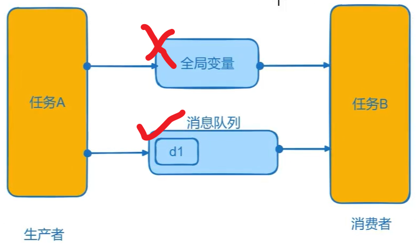

### 12.2 队列使用以及说明

~~~
1）队列的创建 xQueueCreate(UBaseType_t uxQueueLength，UBaseType_t uxItemSize); 
	功  能：动态创建一个队列，并返回队列的句柄（失败返回NULL）
	参  数：uxQueueLength 队列可以容乃的最大项目数
	       uxItemSize 队列中每一项的所需的字节大小

2）队列的创建 xQueueSend(QueueHandle_t xQueue,
                       const void* pvItemToQueue,
                       TickType_t xTickToWait); 
	功  能：向队列中发送一个数据。
	参  数：xQueue 队列的句柄，数据项将发布到此队列
	       pvItemToQueue 指向待入队数据项的指针
	       xTickToWait 如果队列已满，任务激怒阻塞等待队列出现可用空间的最大时间。（等待的最大时间可以使用宏，proMAX_DELAY,也可以使用 -1 或 ~0）

3）队列的接收数据后删除（ 不删除使用xQueuePeek(); ）
		 xQueueReceive(QueueHandle_t xQueue,
                       void* pvBuffer,
                       TickType_t xTickToWait); 
                       
	功  能：从队列中接收项目，该项目通过复制接收，因此必须提供足够大小的缓冲区。
	参  数：xQueue 队列的句柄，数据项将发布到此队列
	       pvBuffer 指向缓冲区的指针
	       xTickToWait 如果在调用时队列为空，则任务应阻塞等待项目接收的最长时间。

【注意】
	以上发送和接收函数不能放在中断中执行，如果非得需要在中断中发送和接收，也可以使用xQueueSendFromISR()函数 和 xQueueReceiveFromISR()函数。
~~~

## P13、消息队列的实验演示

~~~c
1）实验内容如下：
	如果光敏传感器检测到灯暗，我们就通过消息队列发送数，放入数据100，让小彩灯任务闪烁红灯；
	如果光敏传感器检测到灯亮，消息队列放入数据200，让小彩灯任务闪烁蓝灯。

2）为什么将队列的创建放在任务的创建前面，因为任务一创建就会进入对应的回调函数中（包括队列的回调函数）

3）使用
	1- 先创建一个队列句柄
	2- 使用动态创建一个队列，用句柄接收。
	3- 直接使用发送函数发送数据即可
		xQueueSend(glink_queue,&data,1000); //发送后再此阻塞1000ms
		【拓展】：如果时多个设备，则需要添加设备的ID等信息。
    4- 在其它任务中接收数据，根据实际情况进行判断。
        xQueueReceive(glink_queue,&data,1000);
~~~

## P14、信号量简述

~~~c
//用于实现简单的同步策略（很多情况下，“任务通知”可提供计数信号量的轻量级替代方案）

1）信号量值为1，即为二值信号量。大于1为：计数信号量。

2）二值信号量 创建函数：
	//成功返回句柄，失败返回NULL
    SemaphoreHandle_t xSemaphoreCreateBinary( void );
	
3）释放信号量函数
    //不能在ISR中使用，
    xSemaphoreGive( SemaphoreHandle_t xSemaphore );
    
4）获取信号量函数
    //不能在ISR中使用，
    xSemaphoreTake( SemaphoreHandle_t xSemaphore,
                 TickType_t xTicksToWait );
~~~

## P15、信号量实验

~~~
1）实际步骤：
	1- 创建信号量
	2- 光敏模块判断当前是亮还是暗，然后给出二值信号量【！！！！】
	
2）生产者，先生产在give；消费者，先take在消费。实际上就是解决临界资源的问题。
~~~

## P16、互斥量简述

~~~c
1）互斥量：在信号量的基础之上，加了一个优先级继承机制，防止优先级反转。
	优先级反转：低优先级任务执行时，占用了信号量，导致高优先级的任务阻塞；此时就有可能有一个中优先级的任务阻塞低优先级任务 而后运行自身，导致中优先级任务在高优先级任务前面执行完成
	互斥量解决优先级反转：使用互斥量后，上述低优先级和高优先级任务共用一个互斥量时，低优先级任务 优先级就会暂时 提升为高优先级任务的优先级，从而避免被其它中优先级任务阻塞的情况。
	
2）互斥信号量会产生任务阻塞，所以也不可以在中断ISR中使用。
    所以在同一个任务中，使用take和give保护任务的执行，达到互斥的效果。所以说互斥量也成为互斥锁。
    
3）也有缺陷，所以就有了递归互斥量，但实际上使用更多的还是互斥量，只需要注意：
    1- 在同一个任务中进行获取和释放
    2- 不要在同一任务中获取多次互斥量，否则，第二次就会因为获取不到造成死锁。
~~~

## P17、互斥量实验

~~~
1）使 小灯 和 彩灯 共同抢占一个互斥信号量，使二者不管什么时候，都只有一个任务能运行。

2）LED灯任务 使用互斥量部分。   另一个彩灯任务，也是同样的流程，先一直等待，抢到互斥信号量后再执行操作，执行玩抽再释放互斥信号量。
~~~

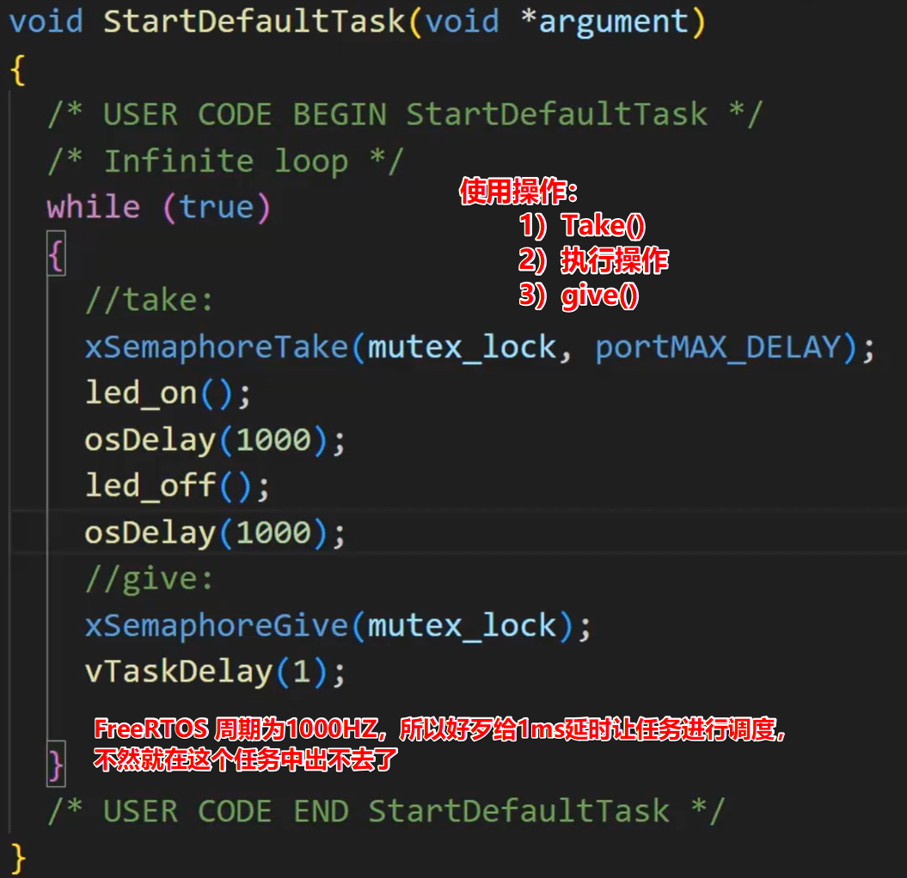

## P18、队列集

~~~c
1）一般处理任务的时候，一般会使用队列或者信号量

2）队列集中的应用逻辑如下。可以将多个队列放在一个队列集中，统一进行阻塞管理，避免需要轮询查询每一个队列的数据处理情况，浪费CPU资源。
~~~

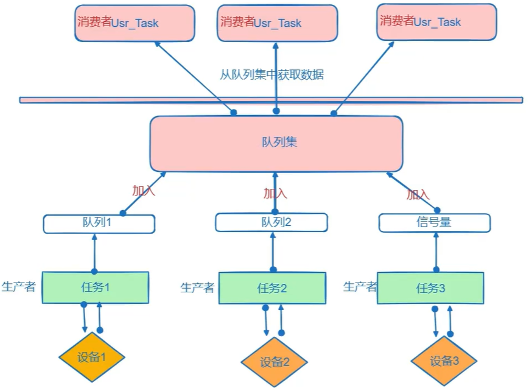

~~~c

// 需要再config.h 中配置队列集宏定义
    
3）函数说明
xQueueCreateSet(); //创建，参数为总长度。
xQueueAddToSet() //添加信号量或队列置队列集中。
xQueueRemoveFromSet() //移除队列集中的元素
xQueueSelectFromSet() //数据没有到达时，不会返回（不能在中断中使用）
xQueueSelectFromSetFromISR() //非阻塞获取“消息”句柄

	使用步骤：
	1- 使用创建队列集函数  xQueueCreateSet()
	2- 添加队列进队列集 xQueueAddToSet()
	3- 使用函数确定集合中包含的队列或信号量 xQueueSelectFromSet()
 
//-----------------------------------
【注意】队列集中不推荐使用互斥信号量。会影响队列集xQueueSelectFromSet()函数获取数据。
~~~

## P19、队列集实验

~~~c
1）队列的创建、二值信号量的创建、队列集的创建
~~~

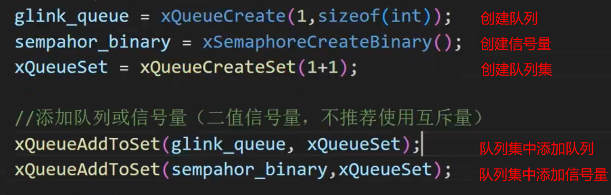

~~~c
2）任务1：执行完成后释放信号量。

3）任务2：读取队列集，判断队列集信号是哪个发出的
	1- 如果是队列发出的，则执行队列操作
	2- 如果是信号量发出的，则执行信号量的同步操作
~~~

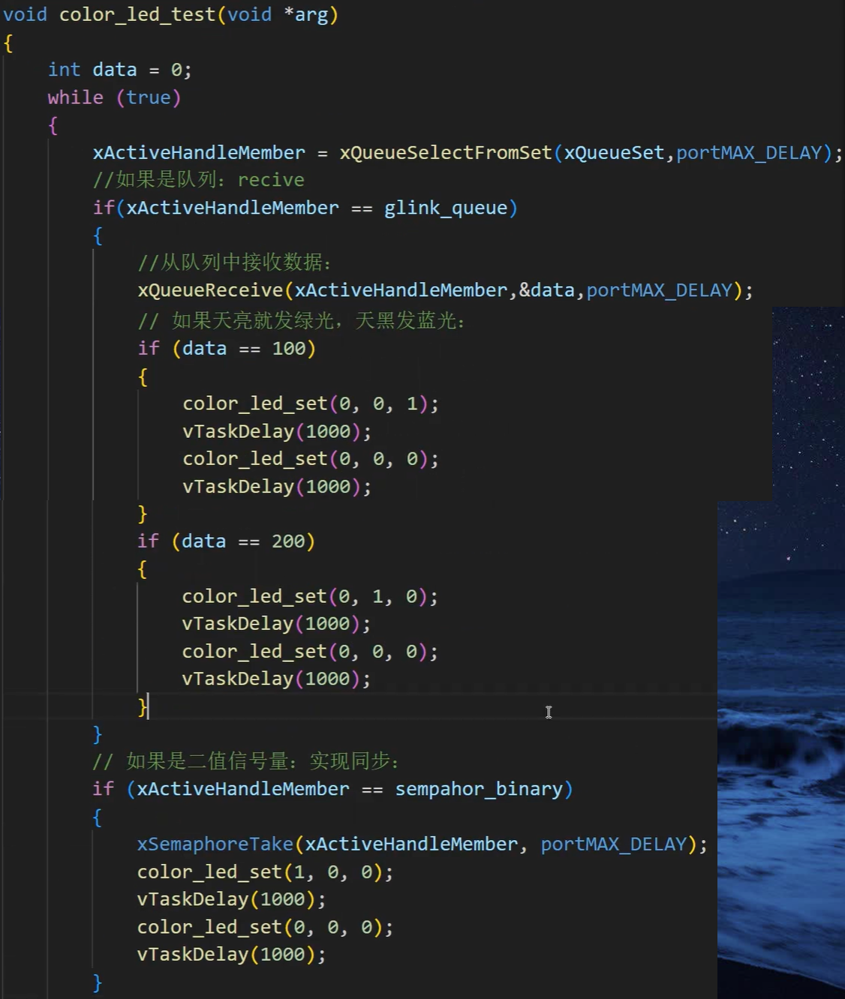

## P20、事件组简述

~~~c
1）事件组概念：是更加精简的一种类似于队列集的方式。但是它是一种 无队列的同步机制 ，可以实现多个任务等待同一个或多个事件的同步机制。

2）事件组结构（一共32位，高8位保留。 24位可用）
	使用一个4字节基本整形来表示一个事件组，高8位留，可处理24个事件。每个bit是事件位表示一个关心的事件是否产生，0为没有产生，1为产生了事件。
	
3）应用逻辑图如下：
~~~

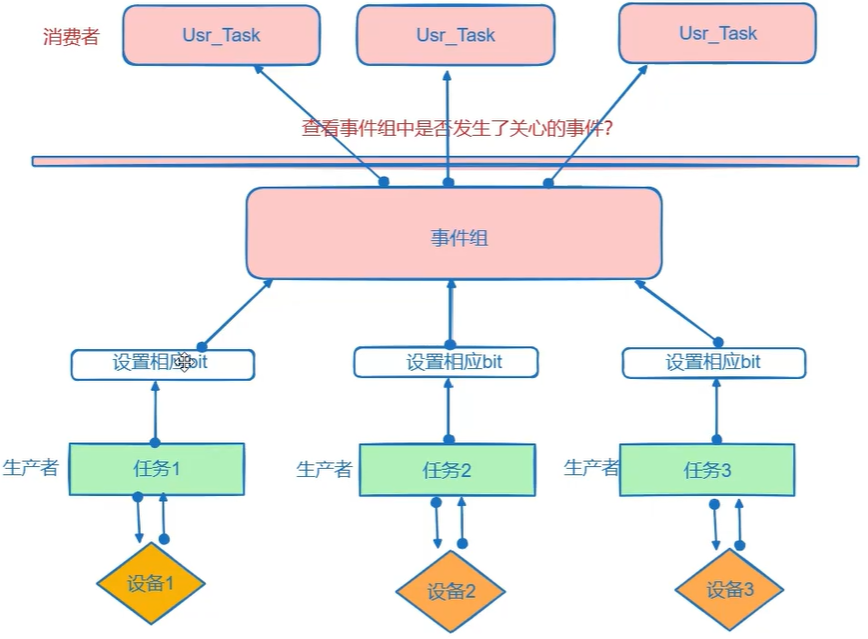

~~~c
3）如何使用事件组
//创建
xEventGroupCreate(); //构建一个事件组

//生产者
xEventGroupSetBits(); //设置一个或多个位的按位值
    
//消费者
xEventGroupWaitBits(); //阻塞等待是否由事件发生
~~~

## P21、事件组的应用实验

~~~c
1）实现需求： F103开发板光源灯闪烁5次，及外部光线暗时。两个条件都满足时，小彩灯闪烁一次红灯。
	生产者： 1- 开发板光源灯闪烁5次
            2- 外部光线暗
    消费者：实现小彩灯闪烁一次红灯
    
2）使用步骤：
    1- 定义事件组变量，动态创建事件组
    2- 在设置条件出使用如下函数设置 bit 位
    //5次闪烁后调用
    xEventGroupSetBits(xEventGroup, 1 << 0);
	//外部光纤暗调用
	xEventGroupSetBits(xEventGroup, 1 << 1);
	3- 消费者中使用事件组的阻塞函数等待事件即可
    group_bits = xEventGroupWaitBits(xEventGroup,1<<0|1<<1,pdTRUE,pdTRUE,protMAXDelay);
~~~

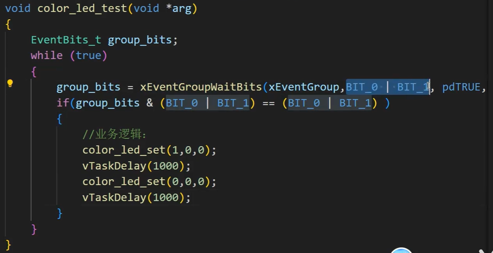

## P22、任务通知简述

~~~c
1）任务通知：提供了一种超轻量级的任务间同步机制。它们非常搞笑，并且不需要使用复杂的数据结构或内存分配，即无需队列，也无需事件组，因此非常适合在嵌入式系统中使用。
	它实现任务一对一的同步通信机制，没有广播共功能。只能任务或ISR向某个任务发出通知。
	
2）不需要使用其它的通讯中间件（队列、信号量、队列集、事件组）即可实现。其优缺点如下：
	优点是：具有高度灵活性，使用时无需单独创建队列、二进制信号量、计数信号量或事件组，通讯效率提高，使用的RAM也更少。
	缺点是：只能1对1。不能完全替代队列，只是一种更轻量级的数据传递。（耦合度会高些）
~~~

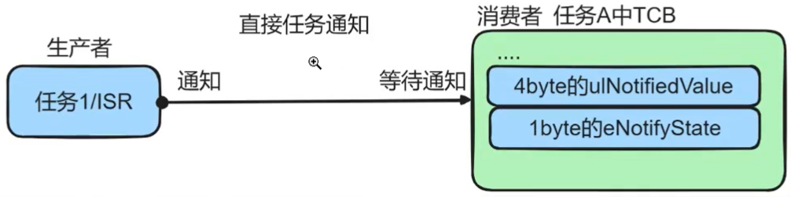

~~~c
xTaskNotifyGive(); //简化版give信号
xTaskNotifyTake(); //简化版take信号
xTaskNotify();     //专业版通知
xTaskNotifyFromISR();
xTaskNotifyWait(); //专业版本等待数据

1）一般是把任务通知，当成轻量级的信号量时，会使用这个 Give 和 Take 函数。

2）函数的用法可以在官网查看，也可参照下一节的实验用法。
~~~

## P23、任务通知实验

~~~
1）生产者 代码：
~~~

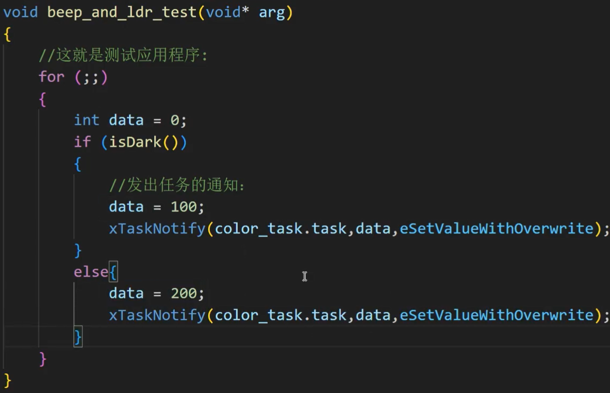

~~~
2）消费者 代码：
~~~

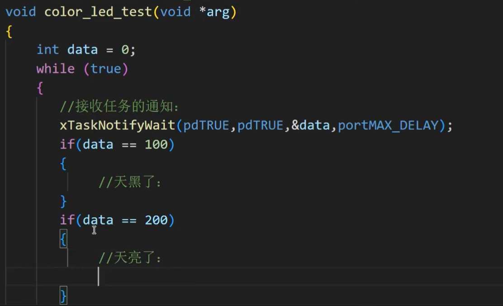

## P24、任务控制与管理总结

~~~
1）任务创建方式
2）任务控制
3）任务间的通信方式
4）任务同步与互斥
5）多任务通信之队列集
6）事件组xEventGroup
7）任务通知（开销小，耦合性高）
。。。
//流缓冲、消息缓冲等
~~~

## P25、中断体系结构简述

~~~
1）中断处理路径
	抢占优先级相同，就顺序执行。有多个就按照自然优先级次序依次执行。
~~~

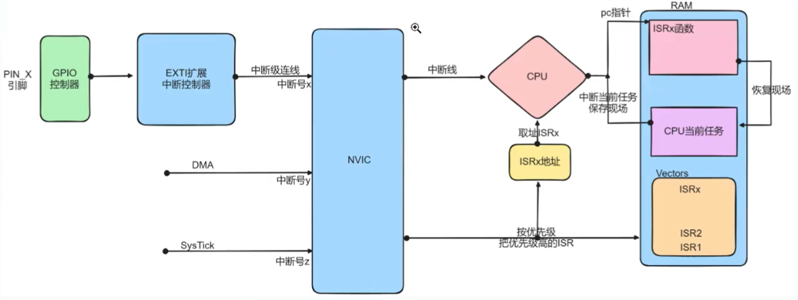

~~~~
2）在芯片启动文件中都有每个中断中的句柄。
3）__weak 函数在ARM中，是可重新实现的函数，是一种函数回调的方式。（注意在ISR中的回调函数中不可以阻塞。）
~~~~

## P26、中断驱动实验

~~~
1）某个GPIO端口引脚，与中断配置在一块
2）使用中断需要
	1- 先确定这个触发使用的是哪个中断源
	2- 以及这个中断源使用的是哪个句柄
~~~

## P27、软件定时器

~~~

~~~

## P28、时刻牢记驱动与应用分离【^_^】

~~~

~~~

## P29、软件定时器消抖实验

~~~

~~~

## P30、任务通知消抖实验

~~~

~~~

## P31、UART简介

~~~
1）异步通信（UART就是一种异步通信方式）
	即通信双方，均独立工作，有各自的时钟源。
	1- 发送方发出数据后，不需要等待接收方及时反馈与确认，可以继续进行其他操作。
	2- 由于异步通信没有使用同步的时钟，所以通常需要额外的控制信息，如：起始位，停止位，校验位来表示数据的开始和结束，确定数据的正确传输和解析。（常见于有两个独立时钟源的设备间通信）
	
2）同步通信
	即通信双方，在共享的同一时钟下工作，使用同一时钟源。
	1- 发送方发出数据后，会等待接收方确认或反馈，然后才能进行下一步继续操作。因为同步通信使用同一时钟，所以收发双方需要严格按照约定好的时序进行操作。
	2- 常见于同一MCU或MPU下与多个外设设备的通信。
	如：I2C，SPI就是一种同步通信方式。
	
3）工作模式（全双工和半双工）
	1- 全双工：指在同一时刻即可发送数据，亦可接收数据。所以一般情况为有两条数据线，发送线与接受线。
	2- 半双工：在同一时刻只能发送数据或接收数据，所以只需要一条数据线即可。
	UART串口是一个全双工的异步的通信接口。
	
4）UART通信协议的时序：从低到高字节发送（LSB-->MSB）
	后面讲的是 根据ST官方提供的usart框图，解释串口收发的原理。
~~~

## P32、搭建UART工程框架

~~~
1）先搭框架
	1- 阻塞版发送数据接口 和 阻塞版接收数据端口函数。
	2- 
2）阻塞串口通信
3）中断非阻塞
4）串口DMA

【注意】
	如果配置过程中，发现串口前面有黄色感叹号，则说明引脚复用了。
~~~

## P33、阻塞版UART串口驱动与应用测试

~~~
1）自己封装 阻塞方式发送数据 以及 阻塞方式接收数据。
2）发送全部一起发，接收一个字节一个字节的循环接收。
~~~

